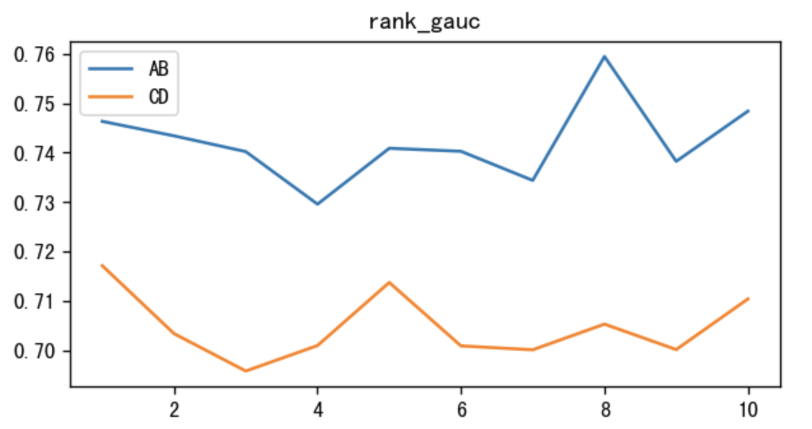
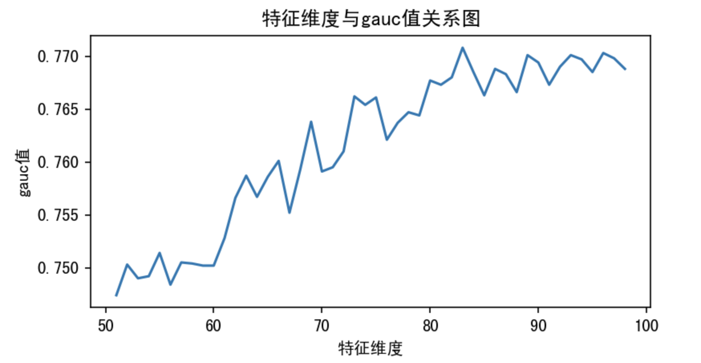
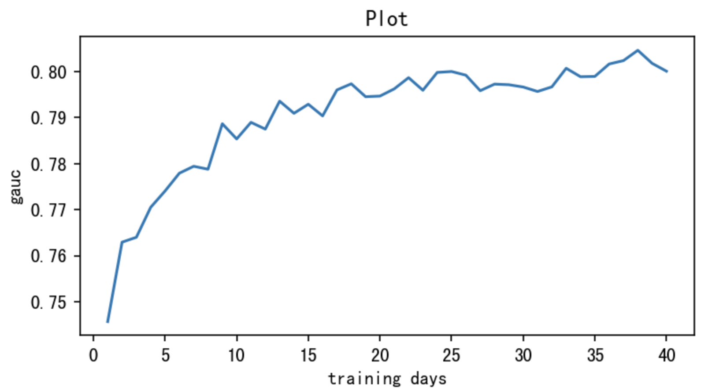

# 【2023-08-09】今日秒杀排序模型迭代
## 背景
- 之前今日秒杀模型迭代在头部车商表现不好，在尾部车商略正，尝试从其他角度优化模型，例如采样、特征、数据量

## 结论
以下为实验组相对对照组的相对提升，皆显著，于2023-09-19推全
- pv维度：出价pv +12.18%，到心理价80%pv +8.01%
- 车源维度：出价车源 +11.16%，到心理价80%车源 +8.13%
- 车商车源对维度：出价pair +13.33%
- 出价深度维度：出价pair按出价深度加权 +13.36%

下单pv +9.66%(38.3 -> 42，不显著，p=0.107)

| (AB-CD)/CD  | 出价pv | 出价pair按深度加权 |	到价80pv | 到价90pv | 下单pv |
|:---:|:---:|:---:|:---:|:---:|:---:|
| 实验前10天  | 0.70% | -1.12% | -3.38%| -8.89% | 7.34% |
| 实验期间 | 12.18%(p=0.002) | 13.36%(p=0.002) | 8.01%(p=0.014) | 2.37%(p=0.235) | 9.66%(p=0.107) |

线上gauc提升3个百分点，跟离线的提升匹配(0.015来自扩充数据量，0.015来自扩充特征)

## 主要优化点

- 样本: 
  - 增加训练集天数10天 -> 56天(离线gauc提升15个千分点)
  - 2023-06-22双塔迭代了一版，导致模型输入的数据分布发生变化，重新用新版召回生成的数据训练也算一波红利
- 特征: 
  - 特征维度: 模型保留特征维度50维 -> 88维(离线gauc提升15个千分点)
  - 新增特征: 用户实时活跃度特征、转化率交叉特征、出价深度交叉特征、模型价格段交叉特征、人车距离特征

特征维度选择dim=79

训练数据多多益善

