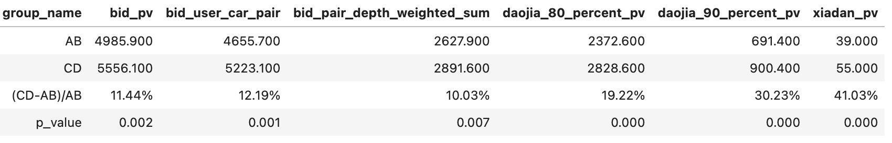
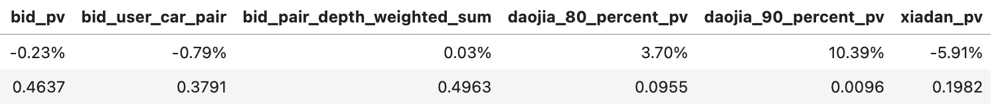

# 【2024-01-23】今日秒杀多目标排序模型
## 背景
- 以往的模型迭代对下单这一指标的关注较少，希望通过不同的训练集采样来提升模型对下单的影响

## 结论
以下为实验组相对对照组的相对提升，皆显著，于2024-03-11转全
- pv维度：出价pv +11.44%，到心理价80%pv +19.22%，到心理价90%pv +30.23%，到心理价100%pv +19.56%，下单pv +41.03%(39 -> 55，预计推全后今日秒杀每日下单+32)
- 车商车源对维度：出价pair +12.19%，到心理价80%pair +19.65%，到心理价90%pair +30.29%，到心理价100%pair +18.82%
- 出价深度维度：出价pair按出价深度加权 +10.03%
- 车源维度：出价车源 +6.73%，到心理价80%车源 +15.13%，到心理价90%车源 +26.20%，到心理价100%车源 +18.45%

02-29~03-09 实验期间十天，已于03-11推全

02-18~02-27 分组前十天

## 离线测试
结论：

- 是否把下单人车对加权相当于控制下单/出价效果的拨片，效果此消彼长，但从下单模型与线上模型的对比中可以看出下单约有10%的提升空间，今日秒杀的空间大于新抢拍
- 拟定上线实验：多目标模型(去掉后处理) vs 线上模型，目标观察下单gauc的提升、下单位置的前移能否带来下单提升

样本规则：

1.多目标模型：

- 正样本
  - 【今日秒杀】场景曝光且出价
  - [t, t+3]之内下单的人车对，跟t出价人车对join并保留bid_ts最大的一行，权重100(重复100遍)
  - t&t+1【收藏】场景出价人车对跟t【今日秒杀】收藏人车对join并保留collect_ts最大的一行(t+1是为了不漏晚上11. 12.的动作)
  - t&t+1【我的出价】场景出价人车对跟【今日秒杀】出价人车对join并保留bid_ts最大的一行
- 负样本
  - 【今日秒杀】场景曝光且未出价、未收藏，负采样成正样本5倍

2.出价为目标模型：

- 正样本
  - 【今日秒杀】场景曝光且出价
- 负样本
  - 【今日秒杀】场景曝光且未出价

下单人车对位置/位置占请求总长度百分比topN%下单召回率出价人车对位置/位置占请求总长度百分比topN%出价召回率

| 模型说明  | 下单测试集gauc | 出价测试集gauc |	下单人车对位置/位置占请求总长度百分比 | 出价人车对位置/位置占请求总长度百分比 |
|:---:|:---:|:---:|:---:|:---:|
| 线上模型  | 0.781 | 0.741 | 39.0/0.35| 55.6/0.36 |
| 出价为目标模型 | 0.852 | 0.774 | 23.4/0.27 | 50.6/0.33 |
| 多目标模型 | 0.864  | 0.761 | 20.5/0.26 | 53.0/0.35 |
| 多目标 - 出价 | +0.012 | -0.013 | ↑2.9/↑1% | ↓2.4/↓2% |
| 多目标 - 线上 | +0.083 | +0.02 | ↑18.5/↑9% | ↑2.6/↑1% |

topN%下单召回率：
- 每个请求截断不同长度，看还能包括多少的下单
- X: 请求截断长度比例
- Y: 截断请求包含的下单人车对占比
- 多目标 vs 出价：打平
- 多目标 vs 线上：top50% Recall rate约 + 10%

topN%出价召回率：
- 每个请求截断不同长度，看还能包括多少的出价
- X: 请求截断长度比例
- Y: 截断请求包含的出价人车对占比
- 多目标 vs 出价：top50% Recall rate约 - 1.3%
- 多目标 vs 线上：top50% Recall rate约 + 2%

